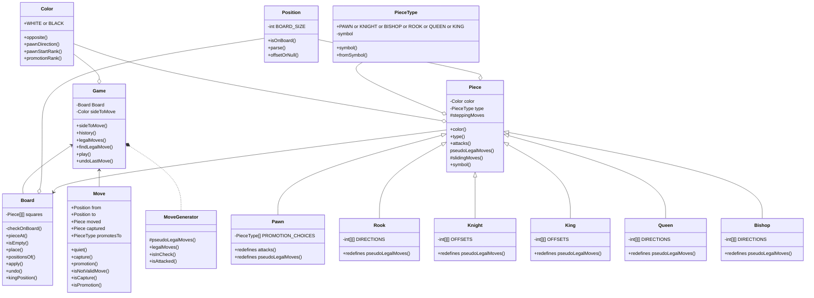

```mermaid
classDiagram
    class MoveGenerator {
        #pseudoLegalMoves()
        +legalMoves()
        +isInCheck()
        +isAttacked()
    }
    class Game {
        -Board Board
        -Color sideToMove
        +sideToMove()
        +history()
        +legalMoves()
        +findLegalMove()
        +play()
        +undoLastMove()
    }
    class Piece {
        -Color color
        -PieceType type
        +color()
        +type()
        +attacks()
        pseudoLegalMoves()
        #slidingMoves()
        #steppingMoves
        +symbol()
    }
    class Pawn {
        -PieceType[] PROMOTION_CHOICES
        +redefines attacks()
        +redefines pseudoLegalMoves()
    }
    class Knight{
        -int[][] OFFSETS
        +redefines pseudoLegalMoves()
    }
    class Bishop{
        -int[][] DIRECTIONS
        +redefines pseudoLegalMoves()
    }
    class Rook{
        -int[][] DIRECTIONS
        +redefines pseudoLegalMoves()
    }
    class Queen{
        -int[][] DIRECTIONS
        +redefines pseudoLegalMoves()
    }
    class King {
        -int[][] OFFSETS
        +redefines pseudoLegalMoves()
    }
    class Board{
        -Piece[][] squares
        -checkOnBoard()
        +pieceAt()
        +isEmpty()
        +place()
        +positionsOf()
        +apply()
        +undo()
        +kingPosition()
    }
    class Color {
        +WHITE or BLACK
        +opposite()
        +pawnDirection()
        +pawnStartRank()
        +promotionRank()
    }
    class Move{
        +Position from
        +Position to
        +Piece moved
        +Piece captured
        +PieceType promotesTo
        +quiet()
        +capture()
        +promotion()
        +isNotValidMove()
        +isCapture()
        +isPromotion()
    }
    class PieceType{
        +PAWN or KNIGHT or BISHOP or ROOK or QUEEN or KING
        -symbol
        +symbol()
        +fromSymbol()
    }
    class Position{
        -int BOARD_SIZE
        +isOnBoard()
        +parse()
        +offsetOrNull()
    }
    Piece <|-- Pawn
    Piece <|-- Rook
    Piece <|-- Knight
    Piece <|-- King
    Piece <|-- Queen
    Piece <|-- Bishop
    Game <-- Board
    Game <-- Move
    Game *.. MoveGenerator
    Color --o Game
    Color --o Piece
    PieceType --o Piece
    Position --o Piece
    Position --o Board
    Piece --> Board
    
```